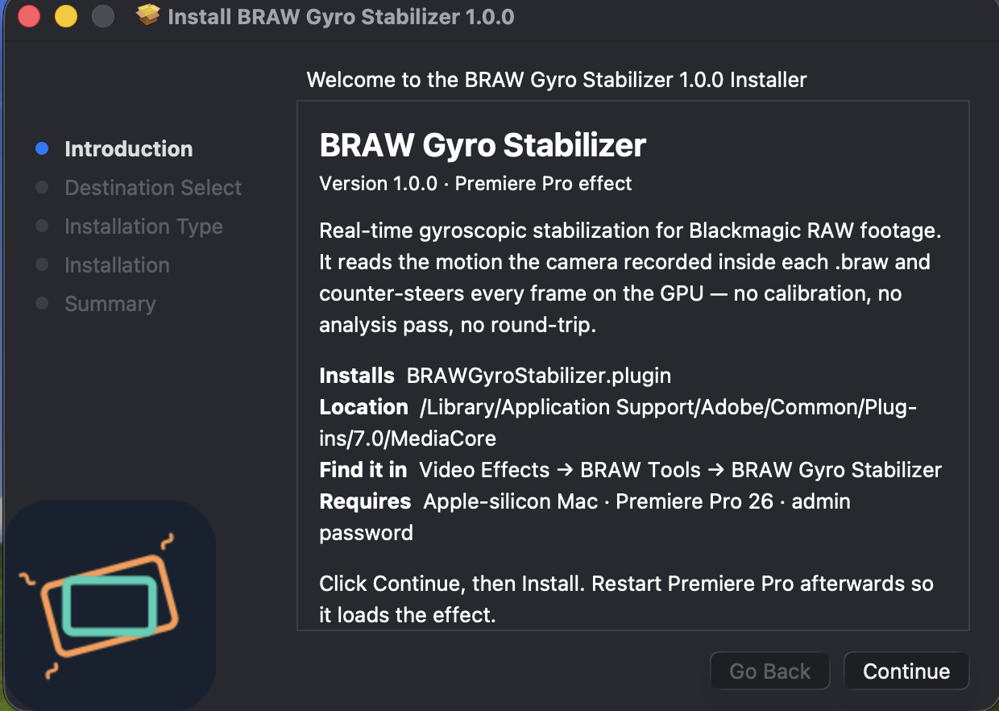
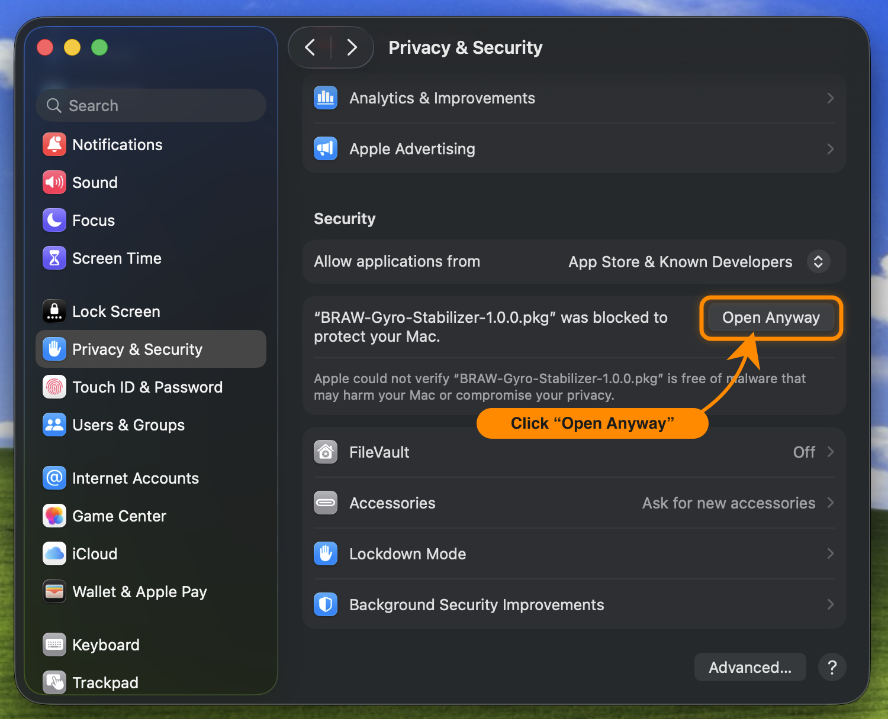
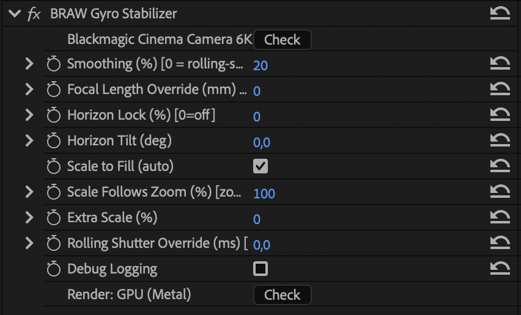

<p align="center">
  
</p>

<h1 align="center">BRAW Gyro Stabilizer — Premiere Pro Plugin</h1>

**Stabilize handheld shots using the motion the camera already recorded.**

Blackmagic cameras save exactly how they moved — from their built-in gyroscope and
accelerometer — inside every `.braw`. This Premiere Pro effect reads that motion and
digitally counter-steers each frame to cancel the shake, live on the GPU. It's the same
gyro data DaVinci Resolve stabilizes with, brought to the Premiere timeline — drop it on
the clip and play.

<p align="center">
  <a href="https://github.com/klishc/braw-gyro-stabilizer/releases/latest">
    
  </a>
  <br>
  <a href="#install">Install guide ↓</a>
</p>

> **macOS (Apple silicon) only for now.** A Windows version (CUDA / OpenCL) is planned if
> there's enough interest — let me know if you'd use it.

---

## Zero calibration, zero setup

Everything it needs is already in the `.braw`, so there's nothing to configure, sync, or
calibrate. Where a standalone gyro stabilizer means round-tripping every clip and building
lens calibration profiles for each combination of lens, resolution, and frame rate, this
does it all automatically:

- **Automatic per-frame focal length** — tracks a zoom lens through the shot; no typing in
  focal lengths or picking a lens. (Using a manual lens? The camera may report a wrong focal —
  set the real value via *Focal Length Override*.)
- **No lens calibration** — it reads the camera's real sensor geometry from the file, so
  there are no profiles to build or maintain for each lens, resolution, or frame rate.
- **Automatic rolling-shutter correction** — sensor readout read from the file, fixed
  line-by-line.
- **Off-speed footage handled automatically** — e.g. shot at 48 fps and interpreted at 24 fps.
- **Works with any BRAW importer** — official Blackmagic or third-party (e.g. Autokroma
  BRAW Studio); it reads the gyro from the file, not from whatever decodes the picture.
- **Instant** — no analysis, no "stabilizing…" pass, no export or re-import; the warp is
  computed per frame on the GPU as you play, so the result is simply *there*.

One caveat: it's built specifically for Blackmagic `.braw` clips that contain embedded
gyro, running on Apple-silicon / Metal — it's not a general-purpose, multi-camera stabilizer.

---

## Supported cameras

Any Blackmagic camera that records gyro into the `.braw` — it isn't tied to a specific
model. Current bodies: Pocket Cinema Camera 4K, 6K, 6K G2 and 6K Pro, Cinema Camera 6K,
**PYXIS 6K**, and the **URSA Cine** line (plus the Micro Studio Camera 4K G2).

Two things to check:

- **Firmware.** Gyro recording was added to the Pocket 4K / 6K family in **Blackmagic
  Camera 7.9** — footage shot on older firmware has no motion data, so update the camera.
  Newer bodies (Cinema Camera 6K, PYXIS, URSA Cine) ship with it. Older cinema cameras
  without a built-in motion sensor (e.g. the URSA Mini Pro) don't record it at all.
- **`.braw` only.** The gyro is written to Blackmagic RAW, not ProRes — a ProRes (`.mov`)
  clip has no motion data to stabilize with, even from a camera that supports it.

Apply it to a clip with no embedded gyro and it just passes the frame through unchanged
(the **Check support** button tells you so).

---

## Install

No building required — grab the installer:

<p align="center">
  
</p>

1. Download **`BRAW-Gyro-Stabilizer-x.x.x.pkg`** from the
   [latest release](https://github.com/klishc/braw-gyro-stabilizer/releases/latest).
2. Double-click it. It isn't signed with an Apple Developer ID, so the first time macOS
   blocks it — *"…was blocked to protect your Mac."* This is expected.
3. Open **System Settings → Privacy & Security**, scroll to **Security**, and click
   **Open Anyway** next to the blocked-`.pkg` message. Confirm with your password / Touch ID,
   then follow the installer prompts (it asks for an admin password).
   - *Older macOS:* you can instead **right-click the `.pkg` → Open**.
4. Restart Premiere Pro.

<p align="center">
  
</p>

That's it — the effect shows up under **Video Effects → BRAW Tools**. (Apple-silicon Mac +
Premiere Pro 26.) To build it yourself instead, see [Building from source](#building-from-source).

**Uninstall:** delete the plug-in and restart Premiere:

```bash
sudo rm -rf "/Library/Application Support/Adobe/Common/Plug-ins/7.0/MediaCore/BRAWGyroStabilizer.plugin"
```

---

## Usage

Apply **Video Effects → BRAW Tools → BRAW Gyro Stabilizer** to a BRAW clip and play — it
reads the gyro and stabilizes on its own. The controls are optional fine-tuning; most of
the time you'll only reach for **Smoothing**.

<p align="center">
  
</p>

| Control | Default | What it does |
|---|---|---|
| **Check support** (button) | — | Read-only. Shows the detected camera, or "Unsupported file" / "No gyro data in clip". |
| Smoothing (%) | 20 | How much the shaky motion is smoothed out. `0` = no smoothing (only fixes rolling shutter); higher = steadier, more locked-off, but crops in further to cover the exposed edges. |
| Focal Length Override (mm) | 0 = auto | Leave at 0 (auto-read per frame). Set a value only if the auto focal is wrong. |
| Horizon Lock (%) | 0 = off | Level the horizon. 0 = off, 100 = fully level. |
| Horizon Tilt (°) | 0 | Tilts the leveled horizon by this many degrees — for deliberately canted shots. Only matters when Horizon Lock is above 0. |
| Scale to Fill | on | Auto-zoom to hide the empty edges the warp exposes. |
| Scale Follows Zoom (%) | 100 | *Zoom lenses only.* Smooths the zoom **motion** — digitally eases a jerky or hard-stopping hand-zoom so it looks motorized. 0 = off (raw zoom); 100 = full smoothing (adds a small constant zoom-in as headroom). No effect on fixed-focal lenses. |
| Extra Scale (%) | 0 | Optional manual zoom on top of the auto-crop. |
| Rolling Shutter Override (ms) | 0 = auto | Leave at 0 (auto-read from the file). |
| Debug Logging | off | Writes diagnostics to `/tmp/brawgyro.log`. |
| **Render path** (button) | — | Read-only. Shows whether it's running on **GPU (Metal)** or **CPU (software)**. |

*Terminology:* "**zoom**" = the lens's optical zoom (focal length); "**scale**" = the
plugin's digital crop.

---

## How it works

The gyro tells the plugin exactly how the camera was pointing at every instant. It
smooths that into the steady move you *wanted*, and the difference between the real
(shaky) and smooth orientation is the correction — applied as a per-frame image warp,
computed line-by-line so a rolling shutter's skew is fixed too, with a small auto-zoom to
hide the edges the warp exposes.

For the details, the core is `src/gyro/GyroIntegrator.cpp` (motion → warp) and
`src/plugin/GPUFilter.mm` (the Metal render path Premiere uses).

---

## Building from source

**Requirements**
- Apple Silicon Mac (arm64), Premiere Pro 26
- Blackmagic RAW SDK at `/Applications/Blackmagic RAW/Blackmagic RAW SDK/`
- Premiere Pro 26.0 C++ SDK **and** the free After Effects SDK, under one SDK root
  (default `~/SDKs/`; override with `-DSDK_ROOT=<path>` or the `SDK_ROOT` env var)
- Xcode command-line tools and CMake: `xcode-select --install` · `brew install cmake`

**Build & install**
```bash
cd /path/to/braw_gyro_stabilizer
./build.sh
```
The script configures, compiles, links, signs, and installs the plug-in into Premiere's
plug-ins folder. **Restart Premiere** to load a freshly built binary.

```bash
./build.sh clean      # wipe the build folder
./build.sh uninstall  # remove from Premiere's plug-ins
```

To produce the double-click `.pkg` installer from a build, run `./package.sh` (output in
`dist/`).

**Project layout**
```
braw_gyro_stabilizer/
├── build.sh                    ← one-shot build + install
├── CMakeLists.txt
├── pipl/BRAWGyroStabilizer.r   ← declares the plugin to Premiere
├── shaders/WarpKernel.metal    ← reference warp kernel
└── src/
    ├── braw/BRAWReader         ← BRAW SDK wrapper (gyro, focal scan, rolling shutter)
    ├── gyro/GyroIntegrator     ← motion → smoothed path → per-row homography + auto-zoom
    ├── warp/MetalWarpEngine    ← Metal warp for the CPU/AE-compat fallback
    ├── plugin/GPUFilter.mm     ← GPU render path (the one Premiere uses)
    ├── plugin/PluginMain       ← effect entry point, params, CPU render
    └── common/                 ← logging, path helpers, per-clip status store
```

---

## Disclaimer

This is an independent project, **not affiliated with, authorized, or endorsed by
Blackmagic Design or Adobe**. It simply reads the motion metadata inside `.braw` files.

"Blackmagic", "Blackmagic RAW", "BRAW", "DaVinci Resolve", "URSA", and "PYXIS" are
trademarks of Blackmagic Design; "Adobe" and "Premiere Pro" are trademarks of Adobe. All
trademarks belong to their respective owners and are used here only to describe
compatibility.
